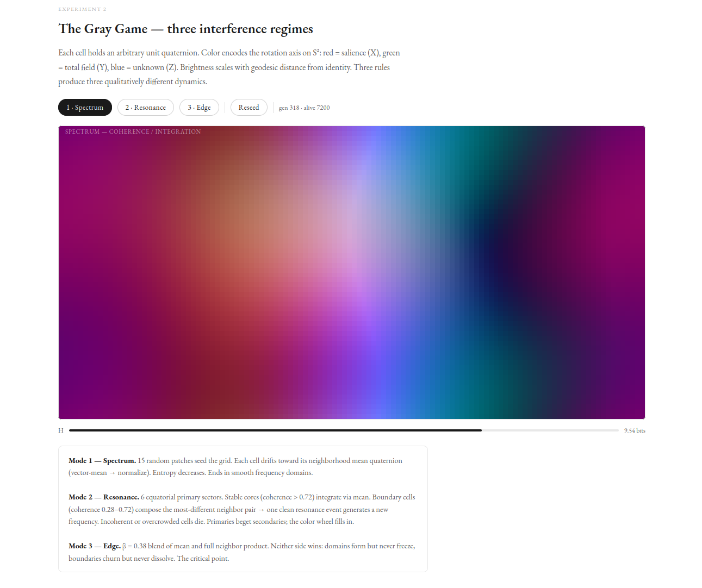

# A Geometric Computer



A complete cognitive architecture on one manifold: S³, the unit 3-sphere.
Every brain state is a unit quaternion. Every update is a Hamilton product.
One arithmetic operation. Five layers. Turing-complete.

**Paper:** [A Geometric Computer](closure_ea/docs/GeometricComputer.pdf) · [Zenodo](https://zenodo.org/records/19578024)
**Zeroth Law:** [Sequence Integrity](zeroth_law_full-1.pdf) · [Zenodo](https://zenodo.org/records/19140055)

---

## What this is

The brain runs a single loop: ingest a carrier, compare the current state against
what the genome predicts, measure the geodesic distance σ. When σ crosses π/4 —
the BKT phase boundary on S³, the Hopf equator — the brain closes: writes to the
genome, updates the hierarchy, corrects its prediction. Learning is repeated closure.
Convergence is a fixed-point theorem.

Five layers build upward from S³:

```
substrate → memory → execution → brain → learning
```

Each layer uses only the layer beneath it. The same Hamilton product that encodes a
unit quaternion rotation also runs a Minsky machine, reads the genome, and integrates
the perceptual field. There is no other arithmetic.

---

## Experiments

**[Run in the browser →](https://faltz009.github.io/Closure-SDK/experiments.html)**
Conway's GoL on S³ and the Gray Game (three interference modes) running live in JS — no install required.

Terminal visualizers (require true-color support):

```bash
cargo run --example gol_live --release           # Conway's GoL on S³, pattern selector
cargo run --example gray_game_live --release     # Gray Game: spectrum / resonance / edge
```

| # | experiment | subject |
|---|---|---|
| 1 | `exp_arithmetic` | Exact modular arithmetic on S³ for Z/nZ orbits |
| 2 | `exp_bkt_phase_transition` | BKT phase boundary at σ = π/4 |
| 3 | `exp_riemann_zeros` | Riemann zeros as local minima in the carrier field |
| 4 | `exp_associative_memory` | Associative recall by σ-radius |
| 5 | `exp_turing` | Turing completeness via 2-counter Minsky machine |
| 6 | `exp_fractran` | FRACTRAN: Turing-complete prime-native computation |
| 7 | `exp_prime_resonance` | Riemann zeros as prime eigenstates on S³ |
| 8 | `exp_collatz` | Collatz sequence: orbit convergence on the carrier lattice |
| 9 | `exp_fiber_memory` | Fiber memory: axis and angle as independent address channels |
| — | `exp_su2_gates` | SU(2) gate dictionary and single-qubit completeness |
| — | `exp_neuromodulated_learning` | Arousal and coherence modulation of the learning regime |

---

## Architecture

```
SUBSTRATE
├── sphere      Hamilton product · inverse · sigma · slerp · IDENTITY
├── embed       SHA-256 → carrier on S³ · Vocabulary · MusicEncoder
├── verify      A?=A · σ · VerificationEvent · Hopf decomposition
└── hopf        S³ → S² × S¹ · factorized addressing · AddressMode

MEMORY
├── buffer      Transient input window (EMBED writes, ZREAD reads)
├── genome      DNA · Epigenetic · Category · nearest-neighbor reads · BKT control
└── field       zread · resonate · coalition accumulation · cos(σ) falloff

EXECUTION
├── carrier     VerificationCell · EulerPlane · TwistSheet · CouplingState
├── execution   MinskyMachine · FractranMachine · OrbitRuntime
└── zeta        Zeta functions over the carrier lattice

BRAIN
├── hierarchy   Recursive closure detection · genome emission
├── localization O(log n) minimal closure interval search
├── consolidation Merge · prune · reorganize epigenetic · DNA is permanent
├── neuromodulation arousal_tone · coherence_tone (observational, session-ephemeral)
└── three_cell  ThreeCell::ingest → buffer → ZREAD → RESONATE → VERIFY
                → Cell A composition → closure → Cell C integration → genome

LEARNING
└── teach       (input, target) pairs · σ-gap error · geometric convergence
```

---

## Running

```bash
cargo run --example exp_arithmetic --release
cargo run --example exp_fiber_memory --release
cargo run --example gol_live --release
cargo run --example gray_game_live --release

cargo test --release     # 55 tests, all passing
```

---

## What you get

```
Identity maintenance      A?=A at any scale. One comparison.
                          σ = 0 at perfect coherence.
                          σ = π/4 at the Hopf equator — the closure threshold.

Two incident types        Missing record (W axis breaks) or reorder (RGB axes break).
                          Algebraic inverses. There is no third type.

Carrier channels          R = salience (X) — the [Total, Unknown] commutator.
                          G = total    (Y) — the full field; the prior.
                          B = unknown  (Z) — what has not been integrated.
                          Known = G − B. Yellow = learned. Blue = novel.

Factorized addressing     Axis queries find semantic type (S²).
                          Angle queries find cyclic position (S¹).
                          Full queries find the exact carrier (S³).

Field resonance           ZREAD reads the genome by proximity, not exact match.
                          Query strength falls as cos(σ), cuts off at σ = π/3.

Genome persistence        DNA layer bootstraps from orbit seeds. Permanent.
                          Epigenetic layer learns from ingest. Consolidates.

Turing completeness       2-counter Minsky machine and FRACTRAN on the carrier substrate.

BrainState serialization  Full state serializes to JSON. Exact round-trip.
```

---

## Enkidu-Alive

An agent with two drives: hunger σ(state, food) and cold σ(state, shelter).
Both are geodesic distances on S³. When both are zero the agent is at IDENTITY —
the algebraic identity element is homeostasis. One comparison per tick. No reward
function. No learned policy. The geometry produces the gradient.

**[Try it live →](https://faltz009.github.io/Closure-SDK/enkidu.html)**

---

## The SDK

The same Hamilton product applied to data integrity. Any ordered byte sequence
composes on S³; if the sequence is intact the product closes; if not, the gap tells
you exactly what broke and where. Built on the same Rust core.

```bash
pip install closure-sdk
```

[Full SDK documentation](README-old.md) · [CLI documentation](CLOSURE_CLI.md)

---

## What's in this repo

| Path | What it is |
|---|---|
| `closure_ea/` | The Geometric Computer — Rust crate. [Paper](closure_ea/docs/GeometricComputer.pdf) |
| `docs/` | Site + live experiments — [experiments.html](https://faltz009.github.io/Closure-SDK/experiments.html) |
| `closure_sdk/` | `pip install closure-sdk` — data integrity SDK |
| `closure_dna/` | `pip install closure-dna` — geometric database |
| `closure_cli/` | CLI surface |
| `rust/` | Shared Rust core |

---

## Tests

```bash
cargo test --release --manifest-path closure_ea/Cargo.toml   # 55 tests
pytest closure_sdk/tests -q
pytest closure_dna/tests -q
```

---

## Support

Independent research, done on personal time, released for free.

| Method | Address |
|---|---|
| BTC | `155jaKugGGhdwX2Dp55bfHWpWbWD3Gr3PG` |
| ETH (ERC-20) | `0x31f0253180b03c16a0aa2d7091311d7363ef22a4` |
| PIX (Brazil) | `walter.h057@gmail.com` |

## License

AGPL-3.0-only
