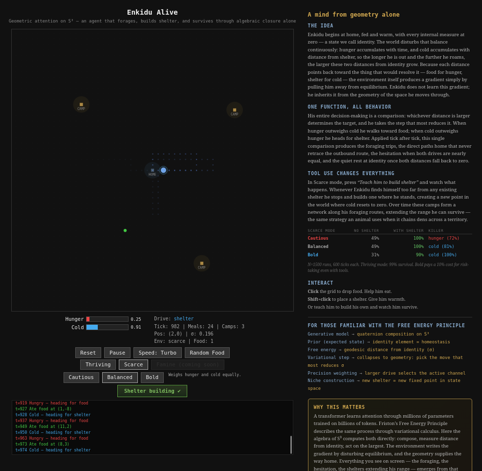

######NEW MODULE CURRENTLY A WORK IN PROGRESS ---

# Closure SDK



**Your pipeline is dropping records?** — one pass tells you which ones, how many, and if they're missing or reordered. → [SDK], [CLI]

**Need your system to maintain its identity and detect any change to the bit level? Replicas drifting? Tampering protection?** — Gilgamesh composes both sequences on the sphere and classifies every discrepancy in a single walk, almost instantly, nothing passes.→ [Gilgamesh]

**Trust? Two parties need to verify they hold the same data without sharing it?** — each side composes locally, exchanges 16 bytes, neither can lie nor hide information from the other and never touch the original content → [Oracle](), [prism], [bind]

**Need your system to learn from mistakes and update priors immediately?** — Enkidu classifies every record as it arrives, and reclassifies when a new one shows up, Enkidu IS learning → [Enkidu]

**Your sensor fleet has a bad node and you're digging through logs?** — every sensor composes its own stream. The moment one diverges, before you pull a single log. → [Seer]

**You want to watch an agent forage, build shelter, and survive through pure algebra?** — zero neural network, zero learned parameters, zero training. The geometry of S³ computes attention directly: compose, measure distance from identity, act on the largest. → [**Try it live**](https://faltz009.github.io/Closure-SDK/) | [Source](closure_ea/enkidu_alive/)

**You want to build AGI? In your room?** — the geometry is S³, the architecture is an 18-step spec, steps 1-3b are validated with 1,031 parameters and a zero-parameter behavioral agent. Check → [Closure Ea](closure_ea/)

## What is this

A primitive data structure, in the same sense that a stack, a queue, or a blockchain is a primitive data structure. A stack is LIFO; a queue is FIFO; a hash map is key-value; a blockchain is a hash chain. This one composes ordered data on S³ — the 3-sphere of unit quaternions, which is the richest space where sequential composition is still associative. The structure follows from two axioms and Hurwitz's theorem, and every other ordered structure projects from it.

Raw bytes go in, SHA-256 hashes them, and the hash composes on the sphere. The result is a point on S³ that cannot be reversed to the original data but can be composed, diffed, inverted, and decomposed into color channels — **a hash you can do algebra on**.

Two systems that compose the same data land on the same point, and they can verify this by exchanging elements without ever exchanging the data itself. Because the elements are built on a cryptographic hash, neither side can fake agreement: the spheres cannot lie to each other, even though neither one knows the other's content or the hash that created it.

Any data that can be serialized to bytes can be composed — databases, blockchains, gene sequences, financial ledgers, network packets, satellite telemetry, event streams, anything ordered.

## How it works

Every record you feed in gets hashed (SHA-256) and placed as a point on a sphere. As records arrive, each new point composes with the previous one — a running product that accumulates the entire sequence into a single value. If every record is present and in order, that product comes back to the starting point: the sequence is coherent, the shape closes. If something is off — a record dropped, a record moved, a byte changed — the product drifts, and the size of the drift tells you exactly how much went wrong.

That's the detection layer, and it's cheap: one summary per stream, constant memory, one comparison to check. But the sphere gives you much more than a yes/no.

When a comparison fails, you need to know *where*. The SDK can record the running product at every step, which means you can binary-search for the exact record that caused the divergence. At a million records, that's about twenty comparisons — you don't scan, you narrow.

Once you've found the break, you need to know *what kind*. The sphere's geometry naturally decomposes every divergence into channels: one channel (W) responds to whether a record exists or doesn't, and three channels (R, G, B) respond to whether a record is in the wrong position. A missing record and a reordered record look different in the gap — two types of problem, always distinguishable, without inspecting the raw data.

When you have two complete sequences and want the full diagnosis, the SDK composes both on the sphere, narrows to the first fault, then walks both sequences side by side classifying every incident it finds — each one tagged with its type, its position in both streams, and the actual payload. One pass handles everything; you don't pay per fault.

When records arrive in real time and you can't wait for both sides to finish, the SDK classifies on arrival instead. A record that shows up on one side without a match on the other gets held for one cycle — if its match arrives late, it was a reorder; if nothing comes, it's promoted to missing. That bounded wait turns "I don't know yet" into a definite answer.

And because the sphere is a group, the summaries themselves are algebraic objects. You can combine two of them, subtract one from another, diff two snapshots to see what changed, patch a third with the result — all without going back to the raw data. "What would the state look like without this batch?" is one operation, not a rescan.

All of this sits on top of SHA-256. The hash makes the summary cryptographic: it can't be reversed to recover the original data, but it can still be composed, diffed, and split into channels. Two systems that want to check whether they hold the same data just exchange summaries — the data itself never moves, neither side learns the other's content, and neither side can fake agreement. The spheres cannot lie to each other.

## What problems does this solve

**"Did my pipeline drop or reorder anything?"**
Both ends of the pipeline keep a running summary. At the end you compare them — if they match, every record arrived intact and in order. If they don't, you can find every discrepancy in a single pass: which records are missing, which ones moved, where in each stream they belong.

**"Are my replicas in sync?"**
Each replica composes a summary of its data. You compare summaries in one operation; a mismatch tells you where to look, and full classification across 500,000 records finishes in under five seconds.

**"Is this sensor drifting?"**
Every sensor in a fleet composes its own stream. When one diverges, the summary tells you how far off it is, and the channels tell you whether it's dropping readings or delivering them out of order — before you pull a single log.

**"Did every step in this workflow actually happen?"**
Compose the expected sequence, then compare incoming data against it. A completed workflow closes; an incomplete one doesn't, and the gap shows you which step is missing versus which step arrived out of turn.

**"Can two parties confirm they have the same data without sharing it?"**
Each side composes locally and shares only the summary. `bind()` determines whether they match, and the raw data never crosses the wire.

## Install

```bash
pip install closure-sdk
```

That's it. Pre-built wheels for Linux, macOS, and Windows — includes the Rust engine, no toolchain required.

**From source** (requires [Rust toolchain](https://rustup.rs/) and [maturin](https://www.maturin.rs/)):

```bash
git clone https://github.com/faltz009/Closure-SDK.git
cd Closure-SDK
pip install -e '.[dev]'   # builds the Rust extension locally
pytest tests -q           # verify everything works
```

## Quick start

```python
import closure_sdk as closure

# Two streams — did anything change?
source = closure.Seer()
target = closure.Seer()

for record in source_stream:
    source.ingest(record)
for record in target_stream:
    target.ingest(record)

result = source.compare(target)
if not result.coherent:
    print(f"Drift detected: {result.drift:.6f}")
```

```python
# Find every incident between two complete sequences
faults = closure.gilgamesh(source_records, target_records)
for f in faults:
    print(f"{f.incident_type}  record={f.record!r}  src={f.source_index}  tgt={f.target_index}")
```

```python
# Classify incidents in real time as records arrive
stream = closure.Enkidu()
for record, position in arrivals:
    result = stream.ingest(record, position, side)
    if result:
        print(f"Reclassified: {result.incident_type}")

# Roll the clock — unresolved records become missing
missing = stream.advance_cycle()
```

```python
# Two systems verify they hold the same data — only summaries cross the wire
result = closure.bind(my_element, their_element)
# result.relation: "equal", "inverse", or "disordered"
```

```python
# See the color channels of any summary
valence = closure.expose(element)
# valence.sigma, valence.base (R, G, B), valence.phase (W)
```

## The CLI

Three commands, one tool. No code required.

**`closure identity`** — you have two files, you want to know every discrepancy between them. Gilgamesh composes both on the sphere, walks them side by side, and gives you a table: what broke, where in each file, the actual record. Clean summary to the terminal, full report saved as JSON with color channels.

```bash
closure identity source.jsonl target.jsonl
```

**`closure observer`** — you have two live streams and want to know the moment they diverge. The Seer watches both for almost nothing (32 bytes per stream, one comparison per window tick). The moment drift is detected, it auto-escalates: dumps the retention buffer into Gilgamesh and hands you the exact incidents. This is the production mode — cheap monitoring with precise diagnosis on demand.

```bash
closure observer --window 1000 source.jsonl target.jsonl
```

**`closure seeker`** — you want every single record classified as it arrives, in real time. Enkidu matches records across both streams, holds unresolved ones for a grace period, and reclassifies when late matches show up. Use this when you need the full play-by-play, not just the final verdict.

```bash
closure seeker source.jsonl target.jsonl
```

All three accept JSONL, CSV, and plain text. `--output report.json` saves the full report. `--help` on any command shows all options.

## The SDK

22 symbols, four layers.

### What you use

| Name | What it is | When to use it |
|---|---|---|
| `Seer` | Running summary, constant memory | Always-on stream watching — detects drift, costs nothing |
| `Oracle` | Full composition history | The Seer said something's wrong, now find where |
| `Witness` | Reference built from known-good data | Check new data against an established baseline |
| `gilgamesh(src, tgt)` | Full-sequence comparator | You have both complete sequences and want every incident |
| `gilgamesh_detailed(src, tgt)` | Full comparator + paths | Same as gilgamesh, plus the composed paths for per-incident color |
| `Enkidu` | Streaming classifier | Records arrive live from both sides, classify as they come |
| `bind(a, b)` | Identity check between two summaries | Confirm two systems agree without exchanging data |
| `expose(element)` | Channel decomposition | See whether a divergence is a missing record or a reorder |
| `incident_drift(inc, src_path, tgt_path)` | Local gap at an incident | Get the drift quaternion at a specific incident's position |
| `RetentionWindow` | Recent-record buffer | Keep raw data around so you can investigate after drift |

### What you can do with summaries

| Function | What it does | When to use it |
|---|---|---|
| `embed(record)` | Hash raw bytes and place them on the sphere | Every record enters through here |
| `compose(a, b)` | Combine two summaries into one | Merging shards, windows, time ranges |
| `invert(state)` | The opposite of a summary | Undo a composition, subtract one stream from another |
| `sigma(state)` | How far from coherent | Zero means everything matches; larger means more drift |
| `diff(a, b)` | The gap between two summaries | What changed between snapshot A and snapshot B |
| `compare(a, b)` | Quick verdict: same or different? | The first thing you check |

### What you get back

| Name | What it holds |
|---|---|
| `ClosureState` | A summary — the object you pass around, compare, and combine |
| `CompareResult` | A drift number and a yes/no coherence flag |
| `LocalizationResult` | The exact position where things diverged, and how many steps it took to find it |
| `IncidentReport` | One incident — its type (missing or reorder), positions in both streams, the payload |
| `DetailedFaults` | Incidents plus both composed paths for per-incident coloring |
| `Valence` | The channel breakdown of any summary: magnitude, direction, existence |
| `IncidentValence` | Channels plus context: which positions, which payload, which axis broke |
| `Binding` | The relationship between two summaries: equal, inverse, or neither |

## How it compares

| | Checksum | Hash chain | Merkle tree | **Closure** |
|---|---|---|---|---|
| Detects change | yes | yes | yes | **yes** |
| How much changed | no | no | no | **yes** |
| What kind of change | no | no | no | **yes** |
| Finds where | no | scan (O(n)) | tree search (O(log n)) | **tree search (O(log n))** |
| Catches reordering | no | yes | no | **yes** |
| Summaries combine | no | no | no | **yes** |
| Algebra after hashing | no | no | no | **yes** |
| Cryptographic | yes | yes | yes | **yes (SHA-256)** |

## Performance

Benchmarked on 64-byte records with the Rust engine.

**What does the sphere math cost on top of the hash?**

| Records | SHA-256 alone | Seer.ingest (hash + compose) | Overhead |
|---|---|---|---|
| 10,000 | 706 ns/event | 727 ns/event | +3% |
| 100,000 | 702 ns/event | 745 ns/event | +6% |
| 1,000,000 | 691 ns/event | 725 ns/event | +5% |

You're already paying for the hash. The composition on top of it is nearly free.

**How fast can it find a corrupted record?** At one million records:

| Method | Time | Comparisons |
|---|---|---|
| Oracle | 6.5 μs | 20 |
| Merkle tree | 13.1 μs | 21 |
| Hash chain | 60.4 ms | 750,001 |

**What about multiple faults?** This is where the difference shows. A Merkle tree has to rebuild after every fault it finds — O(n) per fault, so O(k · n) for k faults. Gilgamesh composes both sequences once and classifies all faults in a single walk — the cost is O(n) regardless of how many faults there are.

| Faults (n=100k) | Merkle tree | Gilgamesh | Speedup |
|---|---|---|---|
| 1 | 368 ms | 362 ms | 1× |
| 5 | 1.85 s | 396 ms | 4.7× |
| 10 | 3.68 s | 383 ms | 9.6× |
| 25 | 9.39 s | 426 ms | 22× |
| 50 | 18.6 s | 384 ms | 48× |

## Who this is for

This is a building block — you embed it in the systems you already run. If you manage data pipelines and need to know whether events arrived intact, if you run replicas and need to know whether they still agree, if you verify integrity across organizational boundaries without exposing the underlying data, this is the primitive that answers those questions. It doesn't replace your pipeline or your database; it gives them the ability to detect, locate, and classify discrepancies that they currently can't.

## What's in this repo

| Path | What it is |
|---|---|
| `closure_cli/` | The CLI — identity, observer, seeker |
| `closure_sdk/` | The SDK — 22 symbols, four layers |
| `closure_rs/` | The engine — Rust core with Python bindings |
| `rust/` | Rust source for the engine |
| `tests/` | 207 tests — SDK algebra, convergence, streaming, binding, CLI integration |
| `benchmarks/` | Head-to-head against SHA-256, hash chains, and Merkle trees |
| `examples/` | Worked examples: drift detection, incident classification, streaming, binding, channels |
| `closure_ea/` | What happens when you teach a neural network to compose on S³ instead of ℝⁿ. Start here if you're curious where this goes next |
| `CLOSURE_SDK.md` | Full technical documentation — theory, architecture, complete API reference |
| `CLOSURE_CLI.md` | CLI documentation — all three commands, options, output formats, architecture |
| `zeroth_law_full-1.pdf` | The paper — [Zenodo](https://zenodo.org/records/19140055) |

## Architecture

```
raw bytes → embed (SHA-256 → sphere) → compose → measure

    Seer        sensor, O(1), detects drift
    Oracle      recorder, O(n), locates in O(log n)
    Witness     reference template, verifies against known-good

    Gilgamesh   static: two complete sequences → every incident
    Enkidu      stream: records arrive in real time → classify on arrival

    Bind        two summaries → equal, inverse, or disordered
    Expose      any summary → channels (σ, RGB, W)

CLI:
    closure identity   — two files → full diagnosis (Gilgamesh)
    closure observer   — live monitoring → auto-escalate on drift (Seer → Gilgamesh)
    closure seeker     — live classification of every record (Enkidu)
```

## The math (if you're curious)

Two proven properties underpin everything:

**Exact sensitivity** — perturbing any single record by distance ε shifts the overall summary by exactly ε. No attenuation, no distortion, regardless of how long the sequence is or where the record sits.

**Uniform detectability** — every position in the sequence is equally sensitive. There are no blind spots — the first record and the millionth are equally visible.

These are theorems, not heuristics. Full proofs are in `CLOSURE_SDK.md`. The foundational paper is [on Zenodo](https://zenodo.org/records/19140055).

## Tests

```bash
pytest tests/ -q   # 207 tests
```

## Support

I'm a psychology student, published neuroscientist (1 small paper lmao) and independent researcher in information geometry and meaning! Every paper and line of code was done on my own time and released for free. If this is useful to you, any donations are very much appreciated.

| Method | Address |
|---|---|
| BTC | `155jaKugGGhdwX2Dp55bfHWpWbWD3Gr3PG` |
| ETH (ERC-20) | `0x31f0253180b03c16a0aa2d7091311d7363ef22a4` |
| PIX (Brazil) | `walter.h057@gmail.com` |

## License

AGPL-3.0-only
